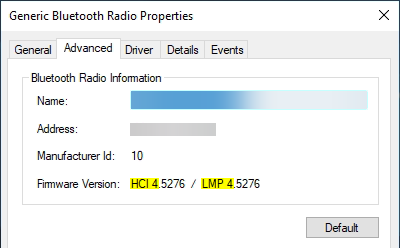
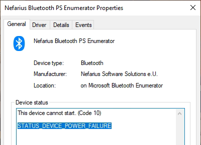

# BthPS3

Windows kernel-mode Bluetooth Profile & Filter Drivers for PS3 peripherals.

[](https://ci.appveyor.com/project/nefarius/bthps3/branch/master)
 [](https://somsubhra.github.io/github-release-stats/?username=ViGEm&repository=BthPS3) [](https://discord.vigem.org) [](https://vigem.org/) [](https://github.com/nefarius) [](https://twitter.com/nefariusmaximus)

---

## ⚠️ ATTENTION ⚠️

**Can cause crash under certain conditions, [see here](https://github.com/ViGEm/BthPS3/issues/19) for details!**

---

## 🚨 NEW RELEASE READY PROGRESS 🚨


## About

**TL;DR:** these drivers allow popular PlayStation(R) 3 gaming peripherals (SIXAXIS/DualShock 3, PS Move Navigation & Motion Controllers) to connect to Windows via Bluetooth without losing any standard functionality. 😊

This set of Windows kernel-mode drivers enhances the standard (a.k.a. vanilla) Bluetooth stack (Microsoft/Broadcom/Toshiba/Intel/...) with an additional L2CAP server service (profile driver) and a USB lower filter driver [gracefully working around the reserved PSMs issue](https://nadavrub.wordpress.com/2015/07/17/simulate-hid-device-with-windows-desktop/) causing the PS3 peripherals connections to get denied on the default Windows stack. The profile driver attempts to distinguish the incoming device types based on their reported remote names and exposes their HID Control and HID Interrupt channels via simple bus child devices (a.k.a PDOs). The profile/bus driver supports both "regular" operation modes (requiring a proper function driver like a HID-minidriver) and "raw" mode (powering the PDO up without a function driver and exposing it to user-land) for maximum flexibility and future-proofing. The PSM filter only attaches to Bluetooth class devices and unloads itself if the underlying enumerator isn't USB.

The solution consists of the following individual projects:

- [`BthPS3`](/BthPS3) - Multi-purpose kernel-mode driver. Function driver for service PDO exposed by `BTHENUM` (Microsoft), Bluetooth profile (L2CAP server service) and bus driver for PS3 wireless peripherals.
- [`BthPS3PSM`](/BthPS3PSM) - Lower filter driver for `BTHUSB`, patching L2CAP packets. Required for profile driver to receive L2CAP traffic.
- [`BthPS3Util`](/BthPS3Util) - User-land command-line utility for managing driver installation tasks and configuration changes.
- [`BthPS3CfgUI`](/BthPS3CfgUI) - User-land GUI utility to safely edit driver settings.
- [`BthPS3SetupHelper`](/BthPS3SetupHelper) - Library hosting utility functions for driver management.
- [`BthPS3CA`](/Setup/BthPS3CA) - Custom Actions for [WiX](https://wixtoolset.org/)-based setup.
- [`BthPS3Setup`](/Setup) - [WiX](https://wixtoolset.org/)-based setup for driver installation and removal.

## Licensing

This solution contains **BSD-3-Clause** and **MIT** licensed components:

- Drivers (BthPS3.sys, BthPS3PSM.sys) - **BSD-3-Clause**
- [Setup](/Setup) (WiX project and assets) - **BSD-3-Clause**
- User-land utilities (BthPS3Util.exe, BthPS3CfgUI.exe) - **MIT**

For details, please consult the individual `LICENSE` files.

## Environment

BthPS3 components (drivers, utilities) are developed, designed and tested for Windows 7 SP1 or newer (x86, x64).

## Supported Bluetooth host devices

The BthPS3 profile driver and supported devices have been tested successfully with host devices following [Link Manager Protocol (LMP)](https://www.bluetooth.com/specifications/assigned-numbers/link-manager/) core specification
version **3** (which equals **Bluetooth 2.0 + EDR**) and higher. Anything lower than that is not advised and not supported. Check your particular chip firmware version in Device Manager prior to installing the drivers:



When loaded onto an unsupported host radio, device boot will fail with `STATUS_DEVICE_POWER_FAILURE`:



For a list of tested devices [consult the extended documentation](https://vigem.org/projects/BthPS3/Compatible-Bluetooth-Devices/).

### Link Manager Versions

| LMP | Bluetooth Version   |
| --- | ------------------- |
| 0   | Bluetooth 1.0b      |
| 1   | Bluetooth 1.1       |
| 2   | Bluetooth 1.2       |
| 3   | Bluetooth 2.0 + EDR |
| 4   | Bluetooth 2.1 + EDR |
| 5   | Bluetooth 3.0 + HS  |
| 6   | Bluetooth 4.0       |
| 7   | Bluetooth 4.1       |
| 8   | Bluetooth 4.2       |
| 9   | Bluetooth 5         |
| 10  | Bluetooth 5.1       |
| 11  | Bluetooth 5.2       |

## How to build

### Prerequisites

- [Step 1: Install Visual Studio 2019](<https://docs.microsoft.com/en-us/windows-hardware/drivers/other-wdk-downloads#step-1-install-visual-studio>)
  - From the Visual Studio Installer, add the Individual component `MSVC v142 - VS 2019 C++ x64/x86 Spectre-mitigated libs`
- [Step 2: Install WDK for Windows 10, version 2004](<https://docs.microsoft.com/en-us/windows-hardware/drivers/other-wdk-downloads#step-2-install-the-wdk>)
- [Step 3: Install the WiX Toolset **v3.14.0.6526**](https://wixtoolset.org/releases/v3-14-0-6526/)

You can build individual projects of the solution within Visual Studio.

## Documentation

Take a look at the [project page](https://vigem.org/projects/BthPS3/) for more information.

## Device tree

Below representation attempts to visualize the relationships between the drivers and devices involved (near host hardware on the bottom, towards exposed child devices on top):

```text
     +----------------------+                                +----------------------+
     |    Navigation PDO    +<----------+         +--------->+      Motion PDO      |
     +----------------------+           |         |          +----------------------+
                                        |         |
                                        |         |
                                        |         |
                                        |         |
                                        |         |
+----------------------+          +-----+---------+------+         +----------------------+
|      SIXAXIS PDO     +<---------+ Profile & Bus Driver +-------->+     Wireless PDO     |
+----------------------+          |     (BthPS3.sys)     |         +----------------------+
                                  +----------+-----------+
                                             ^
                                             |
                                             v
                                  +----------+-----------+
                                  | Bluetooth Enumerator |
                                  |    (bthenum.sys)     |
                                  +----------+-----------+
                                             ^
                                             |
                                             v
                                  +----------+-----------+
                                  |     bthport.sys      |
                                  +----------+-----------+
                                             ^
                                             |
                                             v
                                  +----------+-----------+
                                  |      bthusb.sys      |
                                  +----------+-----------+
                                             ^
                                             |
                                             v
                                  +----------+-----------+
                                  | BthPS3PSM.sys filter |
                                  +----------+-----------+
                                             ^
                                             |
                                             v
                                  +----------+-----------+
                                  |       USB Stack      |
                                  +----------+-----------+
                                             ^
                                             |
                                             v
                                  +----------+-----------+
                                  | USB Bluetooth dongle |
                                  +----------------------+

```

## Installation

Pre-built binaries and instructions are provided by `Nefarius Software Solutions e.U.` and [available as an all-in-one setup](https://github.com/ViGEm/BthPS3/releases/latest) (**note:** officially supports **Windows 10/11** only).

Check out the companion solution [DsHidMini](https://github.com/ViGEm/DsHidMini) for using the controller in games!

### Support

If facing issues please [search on the forums](https://forums.vigem.org/) first for similar cases and possible solutions.

## Contributing

This project was birthed out of curiosity and the drive to learn more about Bluetooth drivers for Microsoft Windows (and a lingering love for the DualShock 3). If it brought you joy please consider checking out the Sponsor-Button on top and toss a coin to your Developer, O' Valley of Gamers 😃

## Sources & 3rd party credits

- [ViGEm Forums - Bluetooth Filter Driver for DS3-compatibility - research notes](https://forums.vigem.org/topic/242/bluetooth-filter-driver-for-ds3-compatibility-research-notes)
- [Arduino - felis/USB_Host_Shield_2.0 - PS3 Information](https://github.com/felis/USB_Host_Shield_2.0/wiki/PS3-Information#Bluetooth)
- [Emulate HID Device with Windows Desktop](https://nadavrub.wordpress.com/2015/07/17/simulate-hid-device-with-windows-desktop/)
- [microsoft/Windows-driver-samples - Bluetooth Echo L2CAP Profile Driver](https://github.com/Microsoft/Windows-driver-samples/tree/master/bluetooth/bthecho)
- [Microsoft Bluetooth DDI - Reserved PSMs](https://docs.microsoft.com/en-us/windows-hardware/drivers/ddi/bthddi/ns-bthddi-_brb_psm#members)
- [Eleccelerator Wiki - DualShock 3](http://eleccelerator.com/wiki/index.php?title=DualShock_3)
- [Link Manager Protocol (LMP)](https://www.bluetooth.com/specifications/assigned-numbers/link-manager/)
