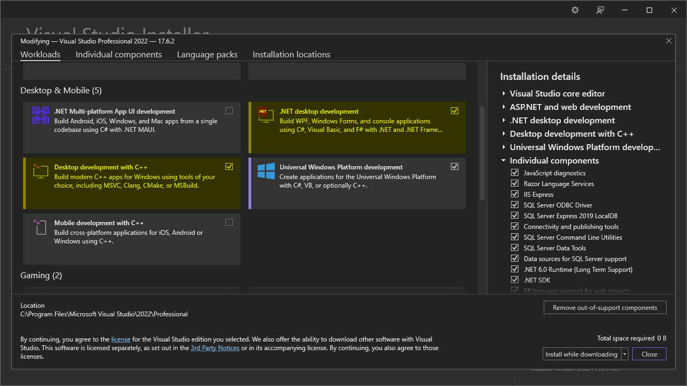
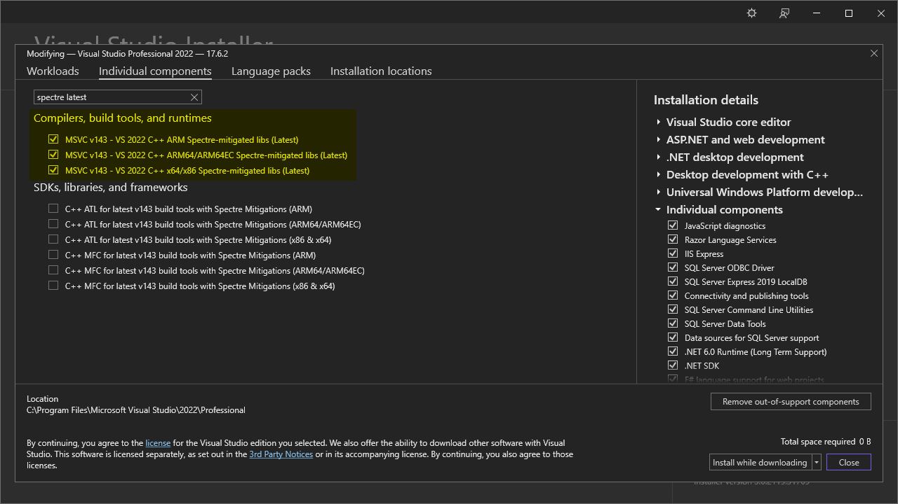

# BthPS3

[](https://ci.appveyor.com/project/nefarius/bthps3/branch/master)
[](https://somsubhra.github.io/github-release-stats/?username=ViGEm&repository=BthPS3)
[](https://discord.nefarius.at)
[](https://github.com/nefarius)
[](https://fosstodon.org/@Nefarius)

Windows kernel‑mode Bluetooth profile and filter drivers for PS3 peripherals.

## Quick start

**For end users who just want to use their PS3 controllers on Windows.**

1. **Check requirements**
   - **OS**: Windows 10 or 11, x64 or ARM64 (see [Environment](#environment)).  
   - **Bluetooth adapter**: must meet the LMP version requirements (see *Supported Bluetooth host devices* in [Environment](#environment)).  
   - **Controller**: PlayStation(R) 3 peripherals (SIXAXIS/DualShock 3, PS Move Navigation & Motion Controllers).
2. **Download the installer**
   - Go to the [latest release page](https://github.com/nefarius/BthPS3/releases/latest).  
   - Download the current **BthPS3 installer** (`.exe`).
3. **Install the drivers**
   - Close any applications using your Bluetooth adapter or controller.  
   - Run the downloaded installer as an administrator and follow the on‑screen instructions.  
   - Reboot Windows when prompted.
4. **Pair your controller (via companion tools, not Windows UI)**
   - **Do not** use the built‑in Windows Bluetooth pairing dialog for PS3 controllers; it will not work correctly and can interfere with proper operation.  
   - Use supported companion tools (such as [DsHidMini](https://github.com/nefarius/DsHidMini)) and follow the pairing instructions in the [project documentation](https://docs.nefarius.at/projects/BthPS3/).  
   - Ensure the controller is first connected via USB if required, then let the companion tool handle Bluetooth pairing as described.
5. **Verify operation**
   - Confirm that the driver is loaded correctly and that your controller appears and responds as described in the [FAQ](https://docs.nefarius.at/projects/BthPS3/Frequently-Asked-Questions/).  
   - For use in games, consider installing the companion project [DsHidMini](https://github.com/nefarius/DsHidMini).

If you run into issues, **carefully read** the documentation and FAQ before opening a GitHub issue.

## Pronunciation

`/biː θriː/`

## About

**TL;DR:** these drivers allow popular PlayStation(R) 3 gaming peripherals (SIXAXIS/DualShock 3, PS Move Navigation & Motion Controllers) to connect to Windows via Bluetooth without losing any standard functionality.

This set of Windows kernel‑mode drivers extends the standard (a.k.a. vanilla) Bluetooth stack (Microsoft/Broadcom/Toshiba/Intel/...) with an additional L2CAP server service (profile driver) and a USB lower‑filter driver, [gracefully working around the reserved PSMs issue](https://nadavrub.wordpress.com/2015/07/17/simulate-hid-device-with-windows-desktop/) that causes PS3 peripheral connections to be denied on the default Windows stack. The profile driver attempts to distinguish incoming device types based on their reported remote names and exposes their HID Control and HID Interrupt channels via simple bus child devices (a.k.a. PDOs). The profile/bus driver supports both “regular” operation modes (requiring a proper function driver such as a HID minidriver) and “raw” mode (powering the PDO up without a function driver and exposing it to userland) for maximum flexibility and future‑proofing. The PSM filter attaches only to Bluetooth‑class devices and unloads itself if the underlying enumerator is not USB.

The solution consists of the following individual projects:

- [`BthPS3`](/BthPS3) – multipurpose kernel‑mode driver: function driver for service PDO exposed by `BTHENUM` (Microsoft), Bluetooth profile (L2CAP server service), and bus driver for PS3 wireless peripherals.
- [`BthPS3PSM`](/BthPS3PSM) – lower‑filter driver for `BTHUSB`, patching L2CAP packets and rerouting L2CAP traffic to the profile driver.
- [`BthPS3CfgUI`](/BthPS3CfgUI) – userland GUI utility to safely edit driver settings.
- [`BthPS3Util`](/BthPS3Util) – userland CLI utility to modify filter‑driver settings.
- [`BthPS3Installer`](/BthPS3Installer) – [WiXSharp](https://github.com/oleg-shilo/wixsharp)-based setup for driver installation and removal.

## Licensing

This solution contains **BSD‑3‑Clause** and **MIT** licensed components:

- Drivers (`BthPS3.sys`, `BthPS3PSM.sys`) – **BSD‑3‑Clause**
- [Installer](/BthPS3Installer)/[Setup](/Setup) (WiXSharp project and assets) – **BSD‑3‑Clause**
- Userland utilities (`BthPS3CfgUI.exe`) – **MIT**

For details, please consult the individual `LICENSE` files.

This is a community project and is not affiliated with Sony Interactive Entertainment Inc. in any way. “PlayStation”, “PSP”, “PS2”, “PS one”, “DUALSHOCK” and “SIXAXIS” are registered trademarks of Sony Interactive Entertainment Inc.

## Environment

BthPS3 components can run on **Windows 10 version 1507 or newer** (x64, ARM64).

<details>

<summary>Supported Bluetooth host devices</summary>

## Supported Bluetooth host devices

The BthPS3 profile driver and supported devices have been tested successfully with host devices following [Link Manager Protocol (LMP)](https://www.bluetooth.com/specifications/assigned-numbers/link-manager/) core specification
version **3** (which corresponds to **Bluetooth 2.0 + EDR**) and higher. Anything lower than that is not recommended and is not supported. Check your particular chip firmware version in Device Manager prior to installing the drivers:


When loaded onto an unsupported host radio, device boot will fail with `STATUS_DEVICE_POWER_FAILURE`:


For a list of tested devices, [consult the extended documentation](https://docs.nefarius.at/projects/BthPS3/Compatible-Bluetooth-Devices/).

### Link Manager versions

| LMP | Bluetooth version   |
| --- | ------------------- |
| 0   | Bluetooth 1.0b      |
| 1   | Bluetooth 1.1       |
| 2   | Bluetooth 1.2       |
| 3   | Bluetooth 2.0 + EDR |
| 4   | Bluetooth 2.1 + EDR |
| 5   | Bluetooth 3.0 + HS  |
| 6   | Bluetooth 4.0       |
| 7   | Bluetooth 4.1       |
| 8   | Bluetooth 4.2       |
| 9   | Bluetooth 5         |
| 10  | Bluetooth 5.1       |
| 11  | Bluetooth 5.2       |

</details>

## Installation

Prebuilt binaries and installation instructions are provided by `Nefarius Software Solutions e.U.` and are [available via the setup](https://github.com/nefarius/BthPS3/releases/latest). Official support covers **Windows 10/11 x64/ARM64** only; issues filed for any other version or architecture will be discarded.

Check out the companion solution [DsHidMini](https://github.com/nefarius/DsHidMini) for using the controller in games.

## How to build

Knowledge of how to build and (test-)sign Windows drivers is required for creating usable builds. This is outside the scope of the project documentation.

<details>

<summary>Build instructions and details</summary>

### Prerequisites

- [Step 1: Install Visual Studio 2022](https://learn.microsoft.com/en-us/windows-hardware/drivers/download-the-wdk#download-icon-step-1-install-visual-studio-2022)
  - On the `Workloads` tab under `Desktop & Mobile`, select *at least* `.NET desktop development` and `Desktop development with C++`.  
    
  - On the `Individual components` tab, search for and select the `Spectre-mitigate libs (Latest)` for all architectures you wish to build for.  
    
- [Step 2: Install Windows 11, version 22H2 SDK](https://learn.microsoft.com/en-us/windows-hardware/drivers/download-the-wdk#download-icon-step-2-install-windows-11-version-22h2-sdk)
- [Step 3: Install Windows 11, version 22H2 WDK](https://learn.microsoft.com/en-us/windows-hardware/drivers/download-the-wdk#download-icon-step-3-install-windows-11-version-22h2-wdk)
- [Step 4: Install the WiX Toolset **v3.14.0.6526**](https://wixtoolset.org/releases/v3-14-0-6526/) (or newer)
- [Step 5: Set up and build Microsoft DMF](https://github.com/Microsoft/DMF/blob/master/Dmf/Documentation/Driver%20Module%20Framework.md#simplifying-compilation-and-linking-with-dmf)
- [Step 6: Set up and build Domito](https://git.nefarius.at/nefarius/Domito#how-to-use)

You can build individual projects of the solution within Visual Studio.

### Branches

The project uses the following branch strategy:

- `master` – stable code base, in sync with tagged public releases
- `devel` – work‑in‑progress changes, mostly larger changes spanning a couple of PRs

### Build artifacts

Tagged CI builds are mirrored [to the buildbot web server](https://buildbot.nefarius.at/builds/BthPS3/); use at your own risk, no support provided.

</details>

## Support & documentation

Everything you need to know is documented [on the project page](https://docs.nefarius.at/projects/BthPS3/). Please read it carefully before considering filing an issue.

Not being able to connect your controller is *not* a bug report. Read the [FAQ](https://docs.nefarius.at/projects/BthPS3/Frequently-Asked-Questions/) and **accept** what is written there.

<details>

<summary>Architecture overview</summary>

## Device tree

The diagram below visualizes the relationships between the drivers and devices involved (host hardware at the bottom, exposed child devices towards the top):

```text
     +----------------------+                                +----------------------+
     |    Navigation PDO    +<----------+         +--------->+      Motion PDO      |
     +----------------------+           |         |          +----------------------+
                                        |         |
                                        |         |
                                        |         |
                                        |         |
                                        |         |
+----------------------+          +-----+---------+------+         +----------------------+
|      SIXAXIS PDO     +<---------+ Profile & Bus Driver +-------->+     Wireless PDO     |
+----------------------+          |     (BthPS3.sys)     |         +----------------------+
                                  +----------+-----------+
                                             ^
                                             |
                                             v
                                  +----------+-----------+
                                  | Bluetooth Enumerator |
                                  |    (bthenum.sys)     |
                                  +----------+-----------+
                                             ^
                                             |
                                             v
                                  +----------+-----------+
                                  |     bthport.sys      |
                                  +----------+-----------+
                                             ^
                                             |
                                             v
                                  +----------+-----------+
                                  |      bthusb.sys      |
                                  +----------+-----------+
                                             ^
                                             |
                                             v
                                  +----------+-----------+
                                  | BthPS3PSM.sys filter |
                                  +----------+-----------+
                                             ^
                                             |
                                             v
                                  +----------+-----------+
                                  |       USB Stack      |
                                  +----------+-----------+
                                             ^
                                             |
                                             v
                                  +----------+-----------+
                                  | USB Bluetooth dongle |
                                  +----------------------+

```

</details>

## Sources & 3rd‑party credits

This application benefits from these awesome projects ❤ (in no particular order):

- [ViGEm Forums - Bluetooth Filter Driver for DS3-compatibility - research notes](./Research)
- [Arduino - felis/USB_Host_Shield_2.0 - PS3 Information](https://github.com/felis/USB_Host_Shield_2.0/wiki/PS3-Information#Bluetooth)
- [Emulate HID Device with Windows Desktop](https://nadavrub.wordpress.com/2015/07/17/simulate-hid-device-with-windows-desktop/)
- [microsoft/Windows-driver-samples - Bluetooth Echo L2CAP Profile Driver](https://github.com/Microsoft/Windows-driver-samples/tree/master/bluetooth/bthecho)
- [Microsoft Bluetooth DDI - Reserved PSMs](https://docs.microsoft.com/en-us/windows-hardware/drivers/ddi/bthddi/ns-bthddi-_brb_psm#members)
- [Eleccelerator Wiki - DualShock 3](http://eleccelerator.com/wiki/index.php?title=DualShock_3)
- [Link Manager Protocol (LMP)](https://www.bluetooth.com/specifications/assigned-numbers/link-manager/)
- [Nefarius' Domito Library](https://git.nefarius.at/nefarius/Domito)
- [NUKE Build Automation](https://nuke.build/)
- [Nefarius.Tools.WDKWhere](https://github.com/nefarius/wdkwhere)
- [Nefarius.Utilities.Bluetooth](https://github.com/nefarius/Nefarius.Utilities.Bluetooth)
- [WixSharp (WixSharp) - managed interface for WiX](https://github.com/oleg-shilo/wixsharp)
